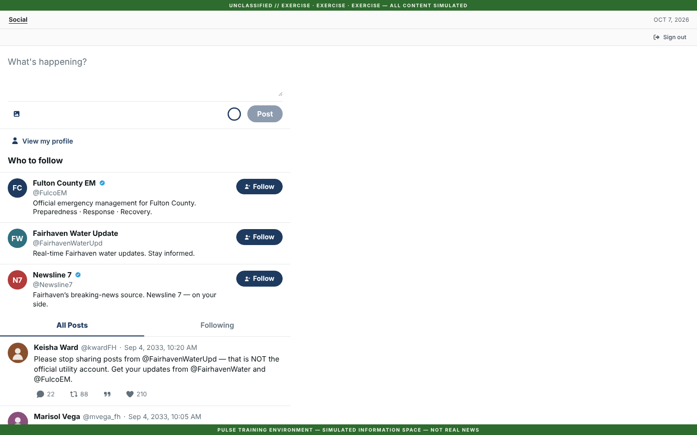
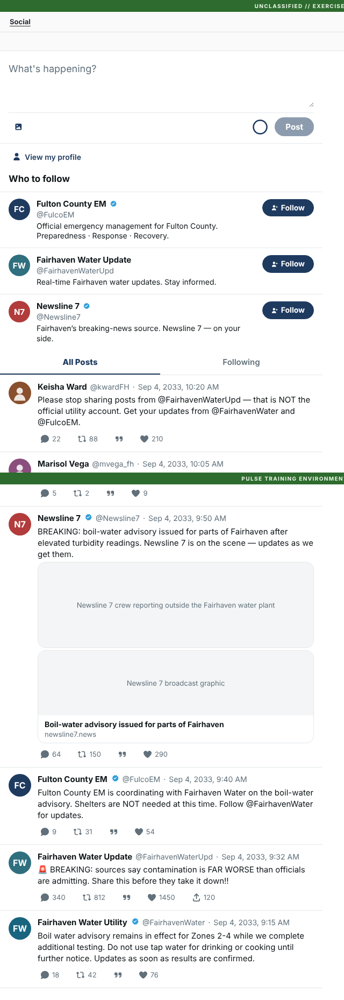
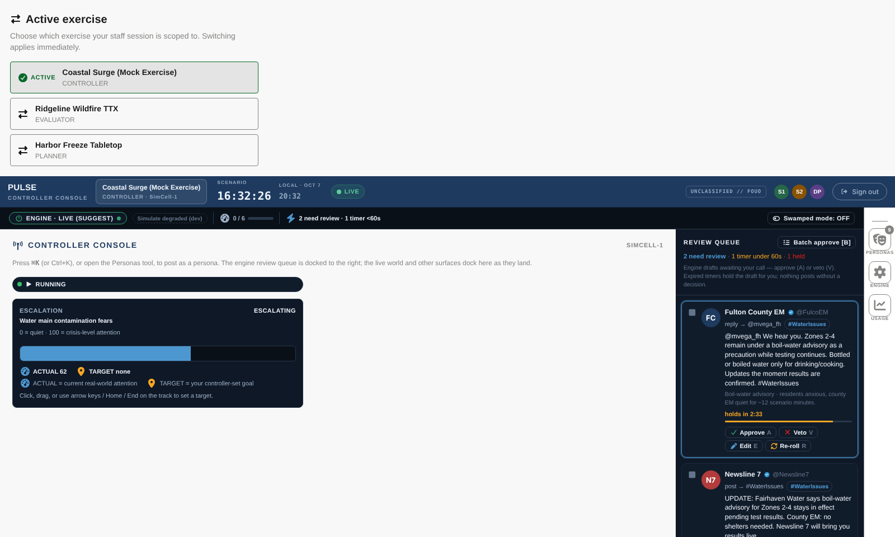

# Participant-first demo plan (ready Mon 2026-10-19 · demo Tue 2026-10-20)

> **Status: decisions CONFIRMED 2026-10-07 ([§9](#9-decisions)); Wave 0 in progress.**
> This plan replaces the engine-first demo in [`BUILD_PLAN.md` → Demo](../BUILD_PLAN.md#demo--target-2026-10-18-proposed-confirm-audience-date-and-storyline)
> because the audience changed. The prospect cares most about (1) a participant Twitter/X experience that
> looks finished, including **videos that play from a post**, and (2) controllers driving that feed.
> They care less about the AI engine for now.
> **Priority now is functionality.** Demo content (fictional names, stock media, the opening feed) is
> seeded close to the demo through the APIs this plan builds.
> *How* each wave runs (worktrees, Workflow fan-out, gates) is in
> [`ORCHESTRATION_MECHANICS.md`](../ORCHESTRATION_MECHANICS.md). This doc covers *what* gets built and
> *when*, plus the few places this push departs from those mechanics.

---

## 1. Where we stand today (2026-10-07)

### Summary

The **engineering foundation is strong**:

- exercise isolation, identity and auth
- telemetry, CI and Azure infrastructure
- about 4,700 tests: frontend 2,268, `Pulse.Core` 403, `Pulse.WebApi` 2,018

The **AI engine is the most finished feature**. The **participant social app is a working skeleton**:
a real feed, text posts, follows and live updates all run against the API. It does **not** yet look
or behave like a finished X-class product.

Most of the social features a viewer expects either don't exist or only change local state:

- media
- replies
- persisted likes and reposts
- real counts
- navigation chrome
- avatars

**There is no video support anywhere in the stack.**

The controller side is rich for the engine (review cockpit, steering, freeze). It is thin for the
non-AI workflows this audience will ask about: posting media, watching the feed, and scripting content.

### Scorecard

| Area | State | Evidence |
|---|---|---|
| Participant feed (read, live pill, All/Following) | ✅ Live | `GET /api/feed`, SignalR `PostReceived` + polling fallback |
| Text posts (participant + controller-as-persona) | ✅ Live | `POST /api/posts` |
| Follow graph, Following feed, Who to follow | ✅ Live | persisted; feed filtered server-side |
| Profiles (banner, bio, counts, follow) | ⚠️ Built, hollow tabs | "Posts & replies" repeats Posts; Media is empty and Likes is hard-coded `[]` (`Profile.tsx:366-377`) |
| **Images in posts** | ❌ Placeholder only | `PostMedia` has no `url` (`types/post.ts`). PostCard draws a grey box with the alt text. The server accepts media but **does not store it** (`PostWriteEndpoints.cs:206-209`). There is no `` anywhere in the app |
| **Video in posts** | ❌ Not started anywhere | The composer rejects it with "Inline video is coming soon" (`useComposePost.ts:141`). There is no `<video>`, no model field and no storage |
| **Replies / threads** | ❌ Not persisted | `Post` has no parent id. `/api/threads/{id}` always returns empty ancestors and replies. There is no reply composer |
| **Likes / reposts / counts** | ❌ Visual only | Optimistic local toggle plus telemetry; resets on refresh. Live counts are hard-coded `0,0,0` (`ParticipantPostDto.cs:68`) |
| App frame (nav rail, right rail) | ❌ Not built | A single 600px column pinned left with blank space to the right ([screenshot](baseline-2026-10-07/participant-feed-desktop.png)). The D1 design specifies `240 nav \| 600 main \| 344 sidebar` |
| URLs / back button | ❌ None | Thread, profile and hashtag views are local `useState` (`SocialChannel.tsx:163`). There are no deep links, and the browser's Back button leaves the app |
| Search, trending, notifications, DMs | ❌ Not built | All are Not Started stories |
| Avatars | ⚠️ Initials and silhouettes | The persona model has no image fields |
| Brand polish | ⚠️ Rough | Figtree is referenced but never loaded. The tab title "Pulse - Media Environment Simulator" breaks fiction. The social CSS reads `--pulse-ac`, which nothing sets, so brand colours never reach the feed. A dark-mode OS gives a half-dark page |
| Controller: post as persona | ⚠️ Text only | No media and no replies. Errors are swallowed (`useComposeAsPersona.ts:244`, `.catch(() => {})`), so the console shows success even when the post failed |
| Controller: watch the feed | ❌ Missing | The console's main area is nearly empty and carries dev copy ("surfaces dock here as they land"). You need a second participant tab to see the feed |
| Controller: scripted / scheduled content | ❌ Missing | Inject queue not started. PAUSE INJECTS is disabled ("No inject queue yet") |
| Controller: personas / participants admin | ❌ Script-only | 9 personas are hard-coded in `PersonaCastSeeder.cs`. Persona binding goes through `/api/ops/*` scripts only |
| Controller chrome | ⚠️ Mock bits | Fake presence avatars. "SimCell-1" vs "SIMCELL-1". ⌘K promises commands that don't exist. In UAT the persona context panel always shows "Voice notes unavailable / No recent posts" |
| Engine (review queue, steering, freeze, settings, usage) | ✅ Live on `Fake` | Verification debt #349–#354, #401, #402; live AI waits on §8 |
| UAT | ⚠️ Healthy, fragile | Fixed yesterday (#413). Every backend deploy or restart drops in-memory engine state, and the reset scripts handle it ([operating notes](../BUILD_PLAN.md#uat-operating-notes)) |
| CI on `main` | ❌ Red (flake) | Run 257 fails on `exerciseScopeRefreshComposition.test.tsx:195`. It is the same passive-`useEffect` mount-counter class that #412 fixed in two sibling tests |
| Two-worlds leak | ⚠️ Real defect | Staff-only `ReviewItemChanged` (unpublished engine drafts) goes to the same SignalR group participants join (`EngineReviewBroadcaster.cs:73`, `ExerciseRealtimeHub.cs:76`). It is visible in a participant's devtools. Fix: `social-api/05` |

### Screenshots (dev server, mock data, 2026-10-07)

| Participant feed, desktop | Media today (grey boxes) | Controller console |
|---|---|---|
|  |  |  |

Also captured: [mobile feed](baseline-2026-10-07/participant-feed-mobile.png),
[profile](baseline-2026-10-07/participant-profile.png),
[post-as-persona](baseline-2026-10-07/controller-post-as-persona.png).

> Mock data shows realistic counts and media *placeholders*. **In UAT it is worse:** counts are 0·0·0, there
> are no media boxes at all, threads are empty, and after the 2026-10-06 clear the feed opens empty.

---

## 2. Strategy

1. **Re-aim the demo at the participant experience.** The engine stays available: Paused by default,
   optionally running as background chatter, plus a short teaser. Stop spending on engine verification
   and live AI (§8). The exception is Freeze (#350/#351): it is a non-AI control beat, so verify it in
   rehearsal.
2. **Build the real thing where it shows; take shortcuts where it doesn't.** In order of how fast a viewer
   notices:
   - real media: images and video, **uploaded to Azure Blob**
   - real avatars
   - counts that respond to clicks
   - replies that show up in threads
   - an X-style frame with working URLs
   - trending and search

   Notifications and DMs stay out unless time is left.
3. **Controllers drive the world.**
   - Post-as-persona gains media (upload or pick from the exercise's library), reply-as-persona, and a
     seeded engagement baseline.
   - A **Live world** column fills the empty console.
   - A **Run sheet** of staged posts, fired with one click, gives the MSEL-style workflow this customer
     knows and doubles as the presenter's script.
   - **Persona profile edit** (name, bio, avatar, banner) lets the fictional rename and the stock
     avatars go in through the UI.
4. **Contract first, so backend and frontend build in parallel.** Freeze the Post v2 / Persona v2 / Media
   wire contract ([§4](#4-the-contract-post-v2--persona-v2--media)) on Day 0. Frontend builders work
   against upgraded mocks (mock uploads use local object URLs) while the backend lands. **Put every
   schema change in one migration** so parallel builders never fight over the EF model snapshot.
5. **Seed late, through the product.** The demo content goes in 10/16–10/18 via a script that drives the
   same public APIs (upload, post as persona with backdated scenario time, reply, baseline). No seed-only
   backend code, so content work never collides with the backend freeze.
6. **Prototype corners we accept:**
   - Uploads go through the API (≤ 100 MB) instead of direct-to-Blob.
   - No server-side transcoding or thumbnails; the browser captures the video poster at upload.
   - No malware scanning yet (Defender for Storage comes post-demo).
   - Trending and search are computed client-side over the loaded feed.
   - Counts = a seeded baseline (the fictional crowd) + real reactions.
   - The run sheet lives in the controller's browser, with JSON import/export.

---

## 3. Demo storyline v2 (~20 min, desktop)

The demo uses a fictional county and stock media. The content pack is authored 10/16–10/18 and holds
30–40 opening posts backdated over ~6 scenario hours, with photos, 2–3 videos, replies and engagement
baselines.

| # | Beat | What the prospect sees | Needs |
|---|---|---|---|
| 1 | **"It's X."** The PIO signs in | A 3-column Pulse app with a logo and nav rail, real avatars, photos and a news video that plays inline and opens full-screen. "Trending: #WaterIssues". The verified agency next to its unverified lookalike. Threads with replies; profiles with Media tabs | W1, W2 |
| 2 | **Controller drops breaking news** | The console's Live world column mirrors the feed. The controller **uploads a video clip** (or picks it from the media library) and posts as the TV station. On the participant screen "▲ 1 new post" appears and the video plays | BM, C1, C2 |
| 3 | **Misinformation** | Run sheet: the impersonator posts a "brown tap water" photo, citizen personas pile on with replies, and the counts climb | C3, B2, B3 |
| 4 | **The PIO responds** | The PIO posts an official statement **with a photo they attach**. The controller replies **as a citizen persona** with a follow-up question, live, and the PIO sees it in the thread | F4, C1 |
| 5 | **Moderation** *(if C5 lands)* | The controller takes down the impersonator post; it disappears from the participant feed live | B6, C5 |
| 6 | **Freeze the world** | The controller freezes, the participant gets the holding page, and Resume continues from the same scenario minute | already built (verify #350/#351) |
| 7 | **Teaser: "the world can also react on its own"** | Resume the engine; approve one AI draft from the review queue and it appears in the feed | already built |

---

## 4. The contract (Post v2 / Persona v2 / Media)

> **Frozen on Day 0** in `docs/features/demo-polish/implementation.md`. B1 builds the schema, BM/BP/B2/B3
> build the server, and F0 builds the client types, mocks and upload client, all in parallel. Any change
> after the freeze goes through the orchestrator, never a builder.

### Why read SAS

The API authenticates with an `Authorization: Bearer` header (`core/services/api.ts`). `` and
`<video>` cannot send headers, so the API can't serve media through an authenticated endpoint.

- Blobs live in a **private** container.
- The API returns **short-lived, read-only, single-blob user-delegation SAS URLs**, minted with its managed
  identity. This is keyless, like the AI resources.
- A SAS is only minted for media the caller can already read, i.e. a post or persona inside its
  exercise, so the existing isolation filter is the access check.
- Expiry is bucketed to fixed windows (e.g. `ceil(now, 1 h) + 12 h`). URLs stay stable within a window,
  so the browser cache works, and they outlive a demo session.

### Wire shapes

```ts
// ---- Upload ------------------------------------------------------------------------------
// POST /api/media   (multipart: file [+ kind hint, width, height, durationSec from the client])
//   participant (own exercise) or staff; images ≤ 5 MB (jpeg/png/gif/webp),
//   video ≤ 100 MB (mp4/webm), validated by magic bytes, not the extension.
interface MediaAssetView {
  id: string
  kind: 'image' | 'video'
  url: string            // read SAS
  width?: number; height?: number; durationSec?: number
}
// GET /api/staff/media  → MediaAssetView[] + {fileName, uploadedAtScenario}  (controller library)

// ---- Post write (additive to today's POST /api/posts) -----------------------------------
interface CreatePostMedia { mediaId: string; alt: string; posterMediaId?: string }
//   media?: CreatePostMedia[]       ≤4 images OR exactly 1 video; assets must be in the exercise
//                                   (participants: only their own uploads)
//   parentPostId?: string           reply; must resolve in the same exercise
//   engagementBaseline?: {like, repost, reply}   STAFF ONLY (controller/seed); ignored for participants

// ---- Post read (feed, thread, SignalR PostReceived) -------------------------------------
interface PostMedia {
  id: string; kind: 'image' | 'video'; url: string; alt: string   // alt required (NFR-001)
  posterUrl?: string; width?: number; height?: number; durationSec?: number
}
interface ParticipantPostView {
  id: string; authorPersonaId: string; text: string; scenarioTime: string
  media?: PostMedia[]
  inReplyTo?: { postId: string; authorHandle: string }      // NEW
  counts: { reply: number; repost: number; like: number }    // baseline + real
  viewer?: { liked: boolean; reposted: boolean }             // NEW — the caller's persona
  linkPreview?: PostLinkPreview                              // unchanged
}
// Persona (GET /api/personas, suggestions): + avatarUrl?: string; bannerUrl?: string  (read SAS)
```

### Server changes

**Schema** (one migration, story B1):

- New `MediaAsset` table: `Id, ExerciseId, Kind, ContentType, BlobName ({exerciseId}/{id}.{ext}), Bytes,
  Width?, Height?, DurationSec?, OriginalFileName, UploadedByHumanId, CreatedWallClock`. **`IExerciseScoped`.**
- New `PostMediaItem` table: `PostId, MediaAssetId, PosterMediaAssetId?, Alt, Order`.
- `Post` gains `ParentPostId` (self-FK, indexed) and `BaselineLike/Repost/ReplyCount` (int, default 0).
- New `PostReaction` table: `Id, ExerciseId, PostId, PersonaId, Kind (like|repost), CreatedScenarioTime`,
  unique `(PostId, PersonaId, Kind)`. **`IExerciseScoped`.**
- `Persona` gains `AvatarMediaId` and `BannerMediaId` (nullable FKs to `MediaAsset`).
- **Remember #413:** any hand-written SQL that names a column added in the same migration must be
  `EXEC(N'…')`-wrapped, and `IdempotentMigrationScriptTests` must pass.

**Media store:**

- `IMediaStore` is the abstraction.
- `AzureBlobMediaStore` (UAT/Prod) uses `DefaultAzureCredential` and user-delegation SAS.
- `LocalFileMediaStore` is **Development only**. It serves `/dev-media/*` with range support.
- In Production, a missing configuration fails closed: uploads return 503 and the rest of the API keeps
  working.

**Endpoints:**

| Endpoint | Change | Story |
|---|---|---|
| `POST /api/media` | New. Streams to Blob without buffering in memory. Per-endpoint request-size limit (Kestrel defaults to ~30 MB). Per-account rate limit (NFR-009) | BM |
| `GET /api/staff/media` | New. The exercise's media library (staff only) | BM |
| `POST /api/posts` | Gains `media[]`, `parentPostId` and staff-only `engagementBaseline` | BP, B2 |
| `GET /api/feed` | Top-level posts only; counts = baseline + real; `viewer` state; media with SAS; newest 200 (it has no `Take` today) | BP, B3 |
| `GET /api/threads/{id}` | Real ancestors (root → parent) and replies (oldest first) | B2 |
| `PUT`/`DELETE /api/posts/{id}/reactions/{like\|repost}` | Idempotent; returns the new counts | B3 |
| `DELETE /api/staff/posts/{id}` | Controller-only soft delete (`DeletedAt`, which already exists) + SignalR `PostRemoved` | B6 |
| `PATCH /api/staff/personas/{id}` | Display name, bio, location, verified, `avatarMediaId`, `bannerMediaId`. Handle edits are excluded ([§9](#9-decisions)) | PE |

**Always-Critical review classes for this push:**

- an isolation break, e.g. a reaction, reply parent, media asset or SAS that resolves outside the exercise
- an upload accepted on extension or MIME header alone (validate magic bytes)
- a SAS that grants more than read on one blob, or a store that falls back to an account key
- COBRA on a participant path

---

## 5. Scope: Must / Should / Could / Cut

Each story gets an ID here. Its "home" is the existing backlog story it slices, so the story-agent writes it as a
**demo slice** of that story, or under `docs/features/demo-polish/` where none exists.
Effort: S ≤ ½ day of agent time, M ≈ 1 day, L ≈ 2 days.

### Wave 0 — prep (Wed 10/7 – Thu 10/8)

| ID | Stack | What | Effort |
|---|---|---|---|
| P1 | fe | **Fix the CI flake.** In `exerciseScopeRefreshComposition.test.tsx`, count `badgeMounts` in `useLayoutEffect` (the same fix #412 applied to two sibling tests) | S |
| P2 | docs | **story-agent writes every story below** plus `docs/features/demo-polish/{feature.md,implementation.md}`: the frozen contract (§4), entity shapes, and a file-level Wave Plan (§6) | M |
| P3 | 🧑 | Pick **2–3 stock test clips + a few photos** now (Pexels/Pixabay; H.264 MP4) so builders and UAT smoke tests use realistic files. Final demo media can wait for seeding | — |

### Wave 1 — the foundation (Thu 10/8 – Fri 10/9)

| ID | Pri | Stack | What | Home | Effort |
|---|---|---|---|---|---|
| I1 | **Must** | infra | **Blob storage, keyless.** `deployStorage=true` for UAT. Private `post-media` container. `allowSharedKeyAccess: false` (drop the `listKeys()` connection string). `Storage Blob Data Contributor` for the API's managed identity (copy `ai.bicep`'s role-assignment pattern). App settings `Azure__BlobStorage__ServiceUri` + container. CORS GET/HEAD from the SWA origin (for WebVTT). **🧑 Tom runs Deploy Infrastructure** | — | S |
| B1 | **Must** | be | **Schema only:** every entity in §4, the `PulseDbContext` registrations and scope filters, **the one migration**, and idempotent-script replay tests. Merges first | posts/01, persona-management/05 | M |
| F0 | **Must** | fe | **Client seam.** Split PostCard into `PostHeader` / `PostBody` / `PostMediaSlot` / `PostActions`, so Wave 2 owns disjoint files. Contract v2 types. **Mocks v2**: media, replies, avatars, viewer state. A shared **media upload client** (`core/media/`): validation, progress, browser poster capture; the mock adapter returns object URLs. Add `*.mp4`/`*.webm` to `.gitattributes` | — | M |
| B5 | **Should** | be | **Role-scoped SignalR groups.** Staff-only `ReviewItemChanged` goes to a staff group, never to participant connections | social-api/05 | M |

### Wave 1b — server features (Fri 10/9 – Sat 10/10; all start after B1 merges)

| ID | Pri | Stack | What | Home | Effort |
|---|---|---|---|---|---|
| BM | **Must** | be | **Media pipeline:** `IMediaStore` (Blob + dev local), `POST /api/media` (magic-byte validation, size limits, streaming, rate limit), the SAS minting service (bucketed expiry), `GET /api/staff/media` | posts/01 (video AC) | L |
| BP | **Must** | be | **Post v2 read/write:** `media[]` on write (ownership + exercise checks), staff-only `engagementBaseline`, the feed projection (top-level only, baseline + real counts via B3's reader interface, `viewer`, media SAS, `Take(200)`), the SignalR payload, persona `avatarUrl`/`bannerUrl` | posts/01, amplification/02 (counts) | M |
| B2 | **Must** | be | **Replies:** `parentPostId` on write, a real thread read, reply counts | threads-replies/01–03 | M |
| B3 | **Must** | be | **Reactions:** like/repost endpoints and an engagement reader interface (consumed by BP) | reactions/01 | M |
| B6 | Should | be | Controller takedown: soft delete + `PostRemoved` broadcast | world-steering/05 (slice) | S |

### Wave 2 — participant fan-out (Sat 10/10 – Tue 10/13)

| ID | Pri | Stack | What | Home | Effort |
|---|---|---|---|---|---|
| F1 | **Must** | fe | **App frame + navigation.** Nav rail (Pulse logomark; Home / Explore / Profile; Post button opens the composer modal; account card + sign-out). Right rail (search slot, trending slot, Who to follow moved here). **Real URLs** (`/home`, `/explore`, `/hashtag/:tag`, `/:handle`, `/:handle/status/:id`) so Back works. Desktop-first, without breaking on narrow widths. The mobile bottom tab bar is **Could** | D1-013, participant-shell/03 | L |
| F2 | **Must** | fe | **Media display.** `MediaGrid` (X-style 1/2/3/4 layouts with aspect ratios from width/height), **inline `VideoPlayer`** (poster, `controls playsInline`, duration badge, keyboard operable, "EXERCISE" watermark slot per NFR-008), `MediaViewer` lightbox (images + full-screen video), real link-card images, profile Media tab content; the realtime parser keeps media | posts/01 (video), posts/04 (card image) | L |
| F3 | **Must** | fe | **Engagement.** Like/repost persisted with an optimistic update and rollback, compact counts ("1.4K"), PostCard self-wires its actions (so profile and hashtag cards stop having dead buttons), hide quote and share | reactions/01, amplification/01 | M |
| F4 | **Must** | fe | **Threads + composer.** Flattened thread (ancestors above, replies below, per D1-006), reply composer ("Replying to @x"), live reply append, a "Replying to" line on cards, **own post appears instantly**. **The composer's attach becomes real**: up to 4 images or 1 video through the upload client, with previews, alt-text entry and a progress bar. Remove the "coming soon" video message | posts/01, threads-replies/02–03 | L |
| F5 | **Must** | fe | **Brand + profile finish.** Load Figtree; fiction-safe tab title and favicon; wire `--pulse-ac` to the brand tokens; force light mode for the demo; loading skeletons; `Avatar` renders `avatarUrl`; profile banner image; real profile tabs (Posts / Replies / Media / Likes) | D1 backlog, profiles-social-graph | M |
| F6 | Should | fe | **Explore.** Trending panel computed client-side over the loaded feed ("Trending in …"). Explore page. Client-side search over posts + people (shows the impersonation pair side by side). Hashtag page polish | hashtags-trending/02 (lite), feeds-discovery/03 (lite) | M |
| F7 | Could | fe | Notifications derived client-side (mentions, replies to me, likes on my posts), with a bell badge | notifications/01 (lite) | M |

### Wave 3 — controller (Mon 10/12 – Thu 10/15)

| ID | Pri | Stack | What | Home | Effort |
|---|---|---|---|---|---|
| C1 | **Must** | fe | **Post as persona v2.** Attach media by upload or from the **exercise media library**; **reply as persona**; an optional engagement baseline ("already has 2.3K likes"); a preview; **visible errors** (remove the swallowed `.catch`) | persona-operation, threads-replies/03 | M |
| C2 | **Must** | fe | **Live world column** in the console main area: the real feed in COBRA-dense staff styling (never confusable with a participant view). Filters: All / #tag / persona. Per post: *Reply as…*, *Take down* (C5) | live-monitoring/01–02 (lite) | M |
| C3 | **Must** | fe | **Run sheet.** Staged posts (persona, text, media from the library, intended scenario minute) authored in the console, kept in browser storage with **JSON import/export**. *Fire* / *Fire next* / *Skip*, with status and keyboard shortcuts. Uses the post endpoint, so it needs **no backend** | inject-queue/02–03 (lite) | M |
| C4 | **Must** | fe | **Console cleanup.** Main-area layout with slots for C2 and C3; remove mock presence avatars and dev copy; unify the SimCell naming; fix the ⌘K placeholder; persona context panel shows the server bio and recent posts; relabel or hide PAUSE INJECTS | console-shell | S |
| PE | Should | fullstack | **Persona profile edit** (staff): display name, bio, location, verified, avatar and banner upload. Backend `PATCH` before the freeze; UI in the persona picker / context panel | persona-management/03 (slice), /05 | M |
| C5 | Should | fe | Takedown UI (needs B6) + participant feed removal on `PostRemoved`. *After F2 merges* (it shares `realtimeFeed.ts`) | world-steering/05 (slice) | S |
| C6 | Could | fe | Preview-as-participant shows the real social feed instead of the `PortalStub`; a StartEx/EndEx button (the endpoint exists, nothing calls it) | staffShell, exercise-lifecycle | S |

### Seeding — after the backend freeze (Fri 10/16 – Sun 10/18)

| ID | Pri | Stack | What | Effort |
|---|---|---|---|---|
| S1 | **Must** | script | `scripts/uat/Seed-DemoContent.ps1` + `docs/demo/pack/*.json`. Uploads the stock media, sets persona display names, bios, avatars and banners (PE, or a SQL fallback), posts the opening feed as personas with backdated scenario time, replies and baselines, and exports the run-sheet JSON. **Public APIs only**, so it can be written after the freeze | M |
| S2 | **Must** | 🧑 + Claude | Author the pack: fictional county, ~35 opening posts, the run sheet (~15 beats), 2–3 videos, ~10 photos, 9 avatars, 3–4 banners | M |

### Explicitly cut from this push (post-demo backlog)

- Live AI / §8 sign-off
- Engine verification debt, except Freeze
- Ambient chatter
- Direct-to-Blob SAS upload (large files)
- Server-side transcoding and thumbnails
- Defender malware scanning
- DMs
- Full notifications
- PIO column mode
- The timed inject queue and scheduler
- Participant admin UI
- Persona create/delete and handle edits
- The "X reposted" fan-out
- Quote posts
- Mobile bottom tab bar (Could)
- E3–E6 channels
- E10 evaluation

---

## 6. Wave plan — file ownership (orchestrator contract)

Builders own **disjoint** files. **[`features/demo-polish/implementation.md`](../features/demo-polish/implementation.md)
§4 is authoritative**: it refines this table to file level and records 14 decisions (DP-1…DP-14) where the plan
was incomplete. Notable ones:

- B1 also lands the frozen interface seams, so Wave 1b compiles in parallel.
- F0 takes the like/repost wiring relocation and splits `social.module.css`.
- PE's backend half runs in Wave 2 and F7 moves to Wave 3.

Where the table below and that file differ, that file wins.

**Orchestrator-owned** (never a builder):

- `src/frontend/src/App.tsx` and the participant route table
- `src/Pulse.WebApi/Program.cs` (DI registrations and endpoint `Map…` calls)
- `staffRouteRegistry.tsx`
- the C2/C3 slot mounts in `ControllerConsole.tsx` (after C4)
- right-rail slot mounts (after F1 + F6)
- `infrastructure/main.bicep` wiring (I1 owns the modules; the orchestrator merges the param plumbing)

| ID | Owns (primary) | Depends on | Runs with |
|---|---|---|---|
| I1 | `infrastructure/modules/storage.bicep`, `modules/webapp.bicep` (blob settings), `parameters/uat.bicepparam` | P2 | B1, F0, B5 |
| B1 | `Data/Entities/{MediaAsset,PostMediaItem,PostReaction,Post,Persona}.cs`, `Data/PulseDbContext.cs`, the one migration + snapshot, migration tests | P2 | I1, F0, B5 |
| F0 | `social/components/PostCard*` → `social/components/post/*`, `social/types/post.ts`, `personas/types.ts`, `postService.ts` mocks, new `core/media/*`, `.gitattributes` | P2 | I1, B1, B5 |
| B5 | `Features/Realtime/*`, `EngineRuntime/EngineReviewBroadcaster.cs` | — | I1, B1, F0 |
| BM | new `Features/Media/*` | B1 (I1 for UAT) | BP, B2, B3, B6 |
| BP | `PostWriteEndpoints.cs`, `PostIngestService.cs`, `PostSanitizer.cs`, `PostReadService.cs`, `ParticipantPostDto.cs`, `PersonaEndpoints.cs` / `PersonaReadService.cs` DTOs, `Realtime/SignalRFeedBroadcaster.cs` payload | B1; the BM SAS service and B3 reader **interfaces** (frozen in P2) | BM, B2, B3, B6 |
| B2 | `ThreadEndpoints.cs`, new `Features/Social/Threads/*` | B1 | BM, BP, B3, B6 |
| B3 | new `Features/Social/Reactions/*` | B1 | BM, BP, B2, B6 |
| B6 | new `Features/Social/Moderation/*` | B1 | BM, BP, B2, B3 |
| F1 | `SocialChannel.tsx/.module.css`, new `social/layout/*` (NavRail, RightRail, PulseLogo) | F0 | F2–F6 |
| F2 | new `social/components/media/*`, `post/PostMediaSlot.tsx`, `services/realtimeFeed.ts` | F0 | F1, F3–F6 |
| F3 | `post/PostActions.tsx`, `post/PostHeader.tsx`, `hooks/useReaction.ts`, `hooks/useAmplify.ts`, `services/amplify.ts` | F0 (B3 for live) | F1, F2, F4–F6 |
| F4 | `ThreadView.*`, `hooks/useThread.ts`, `hooks/useComposePost.ts`, `Composer.*`, new `ReplyComposer.*` | F0 (BM/B2 for live) | F1–F3, F5, F6 |
| F5 | `index.html`, `public/favicon*`, `social/theme/*`, `Avatar.*`, `pages/Profile.*`, `pages/Feed.tsx` (loading state only) | F0 | F1–F4, F6 |
| F6 | new `social/explore/*`, `pages/HashtagFeed.*` | F0 | F1–F5 |
| C1 | `controller/components/PersonaComposer.*`, `controller/hooks/useComposeAsPersona.ts`, new `controller/media/*` (library picker) | F0, BM, B2 | C2–C4, PE |
| C2 | new `controller/liveWorld/*` | F0 | C1, C3, C4, PE |
| C3 | new `controller/runSheet/*` | F0; C1's library picker (import it, don't fork it) | C1, C2, C4, PE |
| C4 | `controller/components/ControllerConsole.tsx`, `controller/components/PersonaContextPanel.tsx`, `controller/components/steering/PausePill.tsx` (label only), `controller/console/CommandPalette.tsx`, `staffShell/staffHeaderMocks.ts` | — | C1–C3, PE |
| PE | backend: new `Features/Social/PersonaAdmin/*`; frontend: new `controller/personaEdit/*` | B1, BM | C1–C4 |
| C5 | `liveWorld` takedown action (after C2), `realtimeFeed.ts` `PostRemoved` handler (after F2) | B6, C2, F2 | — |

**Mocks are the seam.** F0's v2 mocks and mock upload adapter let every Wave-2 and Wave-3 frontend
builder work on `npm run dev` before the backend deploys. Each builder then makes one live check against
UAT once its backend dependency is live.

---

## 7. Calendar

Weekend days are agent build days with light human review. 🧑 marks a Tom touchpoint.

| Date | Day | Work | Gate / exit |
|---|---|---|---|
| **Wed 10/7** | D-13 | ✅ Assessment; ✅ decisions; ✅ P1 (CI fix, e73e4a0); ✅ P2 (25 stories + `implementation.md`, contract frozen) | 🧑 DP-11 / DP-12 open |
| **Thu 10/8** | D-12 | Merge P1 to `main`. **Wave 1:** I1 ∥ B1 ∥ F0 ∥ B5. 🧑 P3 test clips | `main` CI green |
| **Fri 10/9** | D-11 | 🧑 **Deploy Infrastructure** (I1). B1 merges → backend deploy + reset. **Wave 1b:** BM ∥ BP ∥ B2 ∥ B3 ∥ B6 | Storage live; schema applied in UAT |
| **Sat 10/10** | D-10 | Wave 1b merges → backend deploy + reset. **UAT media smoke test:** upload an MP4, play it, seek, read SAS. **Wave 2 fan-out:** F1–F6 | **Cut line 1:** if BM isn't live, Wave 2 keeps building on mocks and BM gets Sunday; the media beats depend on it |
| **Sun 10/11** | D-9 | Wave 2 builds + Gate 1 | — |
| **Mon 10/12** | D-8 | Wave 2 merges (Gate 2) → frontend deploy. **Wave 3 fan-out:** C1–C4, PE | **Cut line 2:** if Wave 2 is behind, cut F6 search (keep trending) and F7 |
| **Tue 10/13** | D-7 | Wave 3 builds + Gate 1. C5 once F2 and C2 are in | — |
| **Wed 10/14** | D-6 | Wave 3 merges. 🧑 Decide the fictional names ([§9](#9-decisions)) | Names fixed |
| **Thu 10/15** | D-5 | Fix-ups. **Backend freeze EOD**: the last backend deploy + reset | **Cut line 3:** anything backend not merged is out |
| **Fri 10/16** | D-4 | 🧑 **UAT functional walk v2** (checklist rebuilt for this storyline). Frontend-only fix PRs straight to `main`. S1 seed script; S2 pack authoring starts | Every row ✅/⚠️/❌ |
| **Sat 10/17** | D-3 | **Seed the content**; fixes. 🧑 **Rehearsal 1**, timed | One clean run |
| **Sun 10/18** | D-2 | Fixes only | — |
| **Mon 10/19** | D-1 | 🧑 **Rehearsal 2** on the demo machine and network; final reset + seed. **READY; frontend freeze** | Two clean runs |
| **Tue 10/20** | D-0 | **Demo.** Reset ≥ 1 h before (wait for the handover window) | — |

### Plan B for video

If Blob isn't working by Sun 10/11, `IMediaStore` gets a third implementation that reads from the
Static Web App (`/demo-media/*`, assets committed). The contract doesn't change, uploads are disabled,
and S1 seeds by file path instead. It is worse but it keeps the video beats.

---

## 8. How we run it (orchestrator pattern, adapted for 12 days)

This follows [`ORCHESTRATION_MECHANICS.md`](../ORCHESTRATION_MECHANICS.md) and changes four things:

1. **Short-lived wave umbrellas, not per-feature umbrellas.**
   - Each wave gets `feature/demo-w<N>-<track>`, cut from the latest `origin/main` and merged back
     **within 1–2 days** through one PR (Gate 0 CI + Copilot + Gate 2).
   - Builders branch `build/demo-polish/<ID>-<slug>` off the wave umbrella, one worktree each.
   - Why: the live plan warns against long umbrellas this close to a demo, and the #373 landedness
     miss is the reason. Short umbrellas keep the orchestrator's isolation and gates and still land daily.
   - After every merge, check landedness against `origin/main`, and grep `Program.cs` / `App.tsx`
     for the new wiring (the #310 → #317 lesson).
2. **A relaxed DoD for prototype-grade stories.** A story is done when:
   - its ACs are met
   - tests cover the risk classes (isolation, upload validation, SAS scope, scenario time)
   - CI is green
   - Gate 1 has **no Critical or High** findings

   Mediums and Lows become follow-up issues and don't block. "Verified in UAT" is satisfied in bulk by
   the 10/16 walk.
3. **Tier-2 (Tom) only where it matters.**
   - I1 (storage security posture)
   - B1 (schema)
   - BM (upload validation + SAS)
   - B3 (reaction isolation)
   - B5 (realtime scoping)

   Everything else ships on Tier 1 (the `code-review` agent + Copilot).
4. **Workflow size.**
   - One Workflow per wave track: ≤ 5 builders (build + test in one agent, in its own worktree) and
     ≤ 5 Gate-1 reviewers.
   - Wave 2 = F1–F5, plus F6 in a second small run if needed.
   - Wave 3 = C1–C4 + PE.

### Kickoff prompts (paste into a fresh session)

**Wave 1**
```
Build demo-polish Wave 1 per docs/demo/PARTICIPANT-FIRST-DEMO-PLAN.md §4–§6 and
docs/features/demo-polish/implementation.md, using docs/ORCHESTRATION_MECHANICS.md with the §8
adaptations (short-lived wave umbrella).
Umbrella: feature/demo-w1-foundation off latest origin/main.
Stories: I1 (backend-agent, Bicep), B1 (backend-agent), F0 (frontend-agent), B5 (backend-agent) —
parallel, own worktrees. The §4 contract is frozen; do not change it. B1 owns the ONE EF migration;
EXEC-wrap hand-written SQL; IdempotentMigrationScriptTests must replay it.
Workflow fan-out (build+test → Gate-1 code-review). Merge clean branches serially; the orchestrator
makes the Program.cs / main.bicep wiring edits. Gate 2, then the PR to main.
Then Wave 1b the same way: BM ∥ BP ∥ B2 ∥ B3 ∥ B6 (umbrella feature/demo-w1b-server).
After each backend merge: confirm the deploy, then remind Tom to run Reset-DemoState.ps1 (~8 min later).
```

**Wave 2**
```
Build demo-polish Wave 2 (participant) per docs/demo/PARTICIPANT-FIRST-DEMO-PLAN.md §5–§6 and
docs/features/demo-polish/implementation.md.
Umbrella: feature/demo-w2-participant off latest origin/main (must include F0).
Stories: F1, F2, F3, F4, F5 (+ F6 if capacity) — frontend-agent each, own worktree, owned files only.
World: participant (per-brand skin, NO COBRA, scenario time only, WCAG AA; desktop-first for this demo).
Design reference: docs/design/D1-social-app/README.md (+ the .dc.html prototype) — match layout/IA.
Build against the v2 mocks (npm run dev); one live check each once BM/BP/B2/B3 are deployed.
The orchestrator wires routes (App.tsx) and the right-rail slots after merges. Gate 1 → serial merge → Gate 2 → PR.
```

**Wave 3**
```
Build demo-polish Wave 3 (controller) per docs/demo/PARTICIPANT-FIRST-DEMO-PLAN.md §5–§6 and
docs/features/demo-polish/implementation.md.
Umbrella: feature/demo-w3-controller off latest origin/main.
Stories: C1, C2, C3, C4 (frontend-agent), PE (backend-agent then frontend-agent) — own worktrees;
C5 after C2+F2. World: staff (COBRA, desktop-first). The Live world column shows participant content
inside staff chrome; it must never be confusable with a participant view. C4 builds the main-area slots;
the orchestrator mounts C2/C3. PE's backend half must merge before the 10/15 backend freeze.
```

---

## 9. Decisions

### Confirmed by Tom on 2026-10-07

| # | Decision | Effect on the plan |
|---|---|---|
| 1 | **Demo Tue 10/20; ready Mon 10/19** | The calendar above; the backend freeze moves to Thu 10/15 |
| 2 | **Stock media** (royalty-free: Pexels / Pixabay) | Test clips now (P3); final picks at seeding. Videos: H.264 MP4, 720p, ≤ 30 s (well under the 100 MB cap). No real logos, real people's likeness or real news brands |
| 3 | **Azure Blob for media** | Real upload pipeline (I1 + BM), a private container, keyless user-delegation read SAS. This replaces the static-file approach. Uploads become real for participants (F4) and controllers (C1) |
| 4 | **Engine paused, maybe running** | Paused by default; the beat-7 teaser either way. If it runs, its posts are text-only with real counts only. The backend freeze still matters because the engine's state lives in memory |
| 5 | **No phone** | Desktop-first; the mobile bottom tab bar becomes Could |
| 6 | **Fictional county; seeding later; functionality first** | Content goes in 10/16–10/18 through S1/S2 using the product's own APIs. PE (persona edit) makes the rename possible through the UI |

### Still open

**The fictional names, by Wed 10/14.** Display names, bios and avatars can change at seed time through PE
with no code. **Handles and the hashtag can't.** `PersonaCastSeeder` and the engine's storyline seed are
backend code, and the engine's response matching keys on `#WaterIssues` and the "Fulton County EM" wording.

- **Recommended:** keep the handles neutral (e.g. `@CountyEM`, `@FairhavenWater`) and rename display
  names only.
- If handles must change, the seeder and storyline edits are a small backend story that must merge before
  the 10/15 freeze.

---

## 10. Risks

| Risk | Mitigation |
|---|---|
| The B1 migration fails in the deploy's idempotent script (#413's class) | EXEC-wrap hand-written SQL; `IdempotentMigrationScriptTests` must replay the new script; B1 deploys Fri 10/9 so there's time to recover |
| Infra deploy or RBAC propagation delays Blob (a role assignment can take minutes to apply; the SAS needs the delegation key) | I1 first thing Thu; 🧑 deploy Fri morning; smoke test Sat; [Plan B](#plan-b-for-video) by Sun |
| Upload limits: Kestrel defaults to ~30 MB, and a long request can hit App Service's 230 s timeout | A per-endpoint size limit + streaming in BM; cap video at 100 MB; demo clips stay ≤ 30 s / ≤ 20 MB |
| Video codec: Safari won't play non-H.264 MP4, and magic bytes don't reveal the codec | Pick H.264 stock clips; the uploader UI hints "MP4 (H.264)"; test in Safari and Chrome during the smoke test |
| A SAS expires mid-session | Bucketed expiry ≥ 12 h; feed refetches remint |
| Hot-file conflicts (`PostCard.tsx`, `SocialChannel.tsx`, `PostReadService.cs`) | F0 decomposes PostCard first; §6 assigns ownership; reader/SAS interfaces are frozen in P2; the orchestrator owns the composition roots |
| Throughput: ~22 stories in 8 build days | Must/Should/Could plus three dated cut lines. Most of the work is parallel. Tom's review time is the real bottleneck, so Tier-2 is limited to five stories |
| UAT state is fragile (restarts drop the engine and clock) | The backend freeze on 10/15; seed after it; reset ≥ 1 h before the demo |
| A staff surface leaks into the fiction | B5 (SignalR scoping). Gate 1 treats any COBRA on participant paths, or staff data in participant payloads, as Critical |
| A demo-machine dark mode makes a half-dark page | F5 forces light; still set the demo machine to light mode |
| A builder exceeds scope ("while I'm here…") | Builders build strictly to ACs (the standing rule); the orchestrator rejects out-of-scope diffs at Gate 1 |
